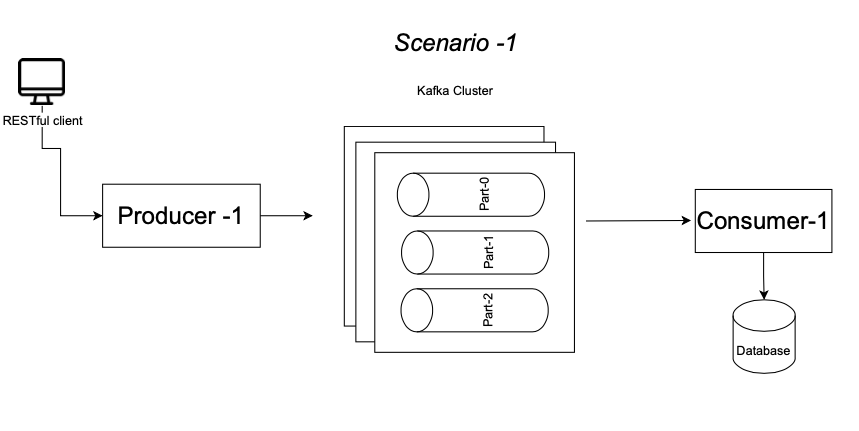
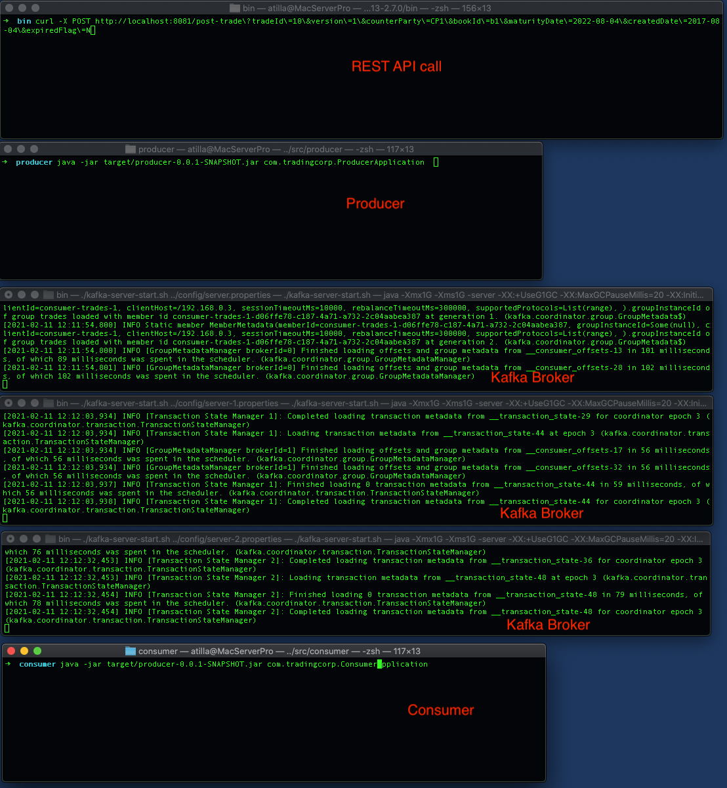
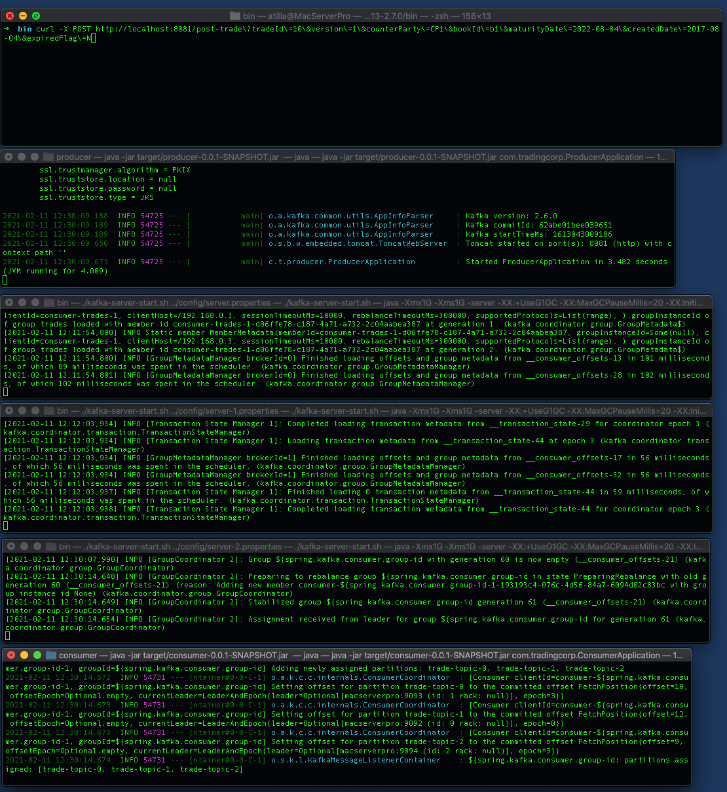
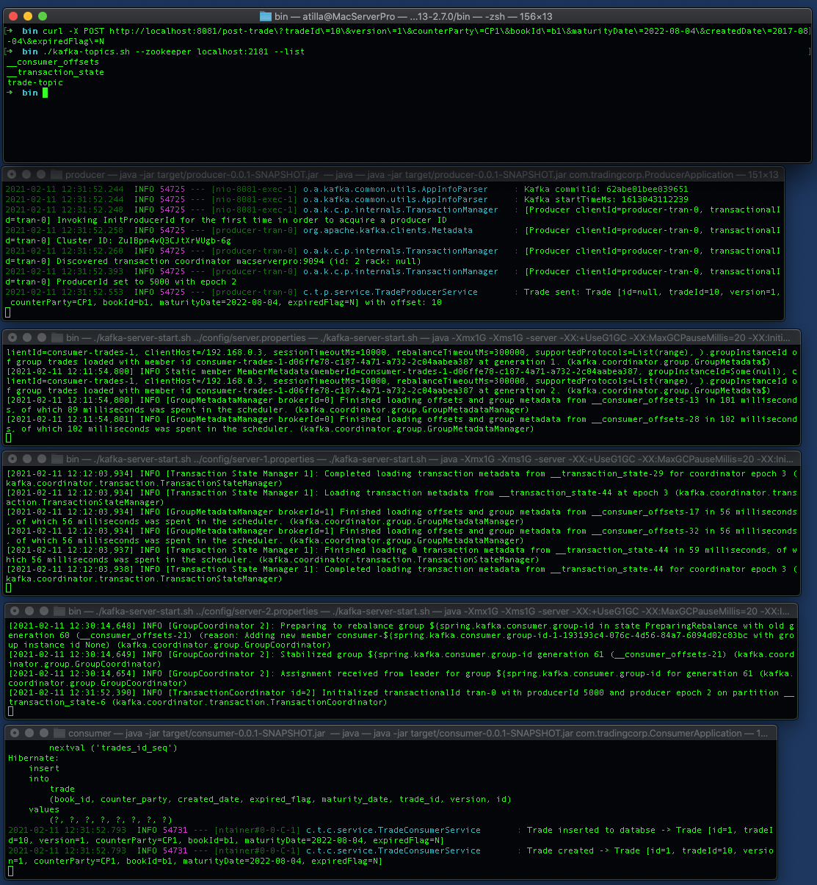
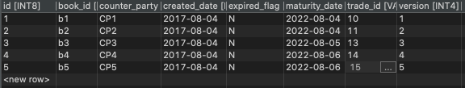
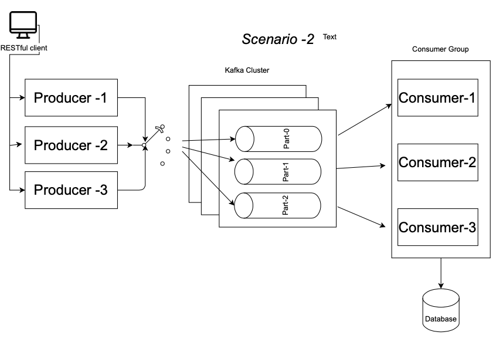
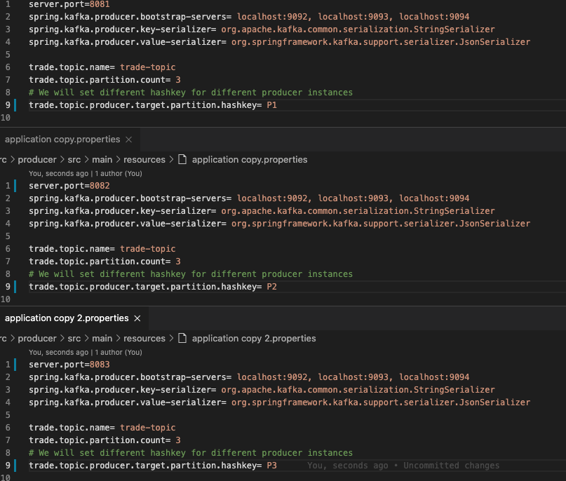

## 1. Solutions

- **Producer:** Spring Boot RESTful java application implemented. The application name is "producer"

- **Consumer:** Spring Boot java application implemented. The application name is "consumer" 

- **Transaction Management :** Transaction management has been applied 


## 2. Scenario 1

- We have one "producer" and one "consumer". They communicate using 3  Kafka Broker, 3 Partition



### 2.1 Implementation Details

#### 2.1.1  Producer 

Configuration: application.propertis
```properties
server.port=8081
spring.kafka.producer.bootstrap-servers= localhost:9092, localhost:9093, localhost:9094
spring.kafka.producer.key-serializer= org.apache.kafka.common.serialization.StringSerializer
spring.kafka.producer.value-serializer= org.springframework.kafka.support.serializer.JsonSerializer

trade.topic.name= trade-topic
trade.topic.partition.count= 3
# We will set different hashkey for different producer instances
trade.topic.producer.target.partition.hashkey= P1 


```

##### Spring RestController for RESTful api requests

```java
@RestController
public class TradeController {

	private final Logger logger = LoggerFactory.getLogger(TradeController.class);

	private TradeProducerService tradeService;

	@Autowired
	public TradeController(TradeProducerService tradeService) {
		this.tradeService = tradeService;
	}

	@PostMapping(path = "/post-trade")
	public void sendTrade(@RequestParam("tradeId") String tradeId, 
			@RequestParam("version") int version,
			@RequestParam("counterParty") String counterParty, 
			@RequestParam("bookId") String bookId,
			@RequestParam("maturityDate") 
			@DateTimeFormat(iso = DateTimeFormat.ISO.DATE) LocalDate maturityDate,
			@RequestParam("createdDate") 
			@DateTimeFormat(iso = DateTimeFormat.ISO.DATE) LocalDate createdDate,
			@RequestParam("expiredFlag") String expiredFlag) {

		Trade trade = new Trade();
		trade.setTradeId(tradeId);
		trade.setVersion(version);
		trade.setCounterParty(counterParty);
		trade.setBookId(bookId);
		trade.setMaturityDate(maturityDate);
		trade.setCreatedDate(createdDate);
		trade.setExpiredFlag(expiredFlag);

		logger.info(String.format("RESTful request -> %s", trade));

		// Validation applied
		if (tradeService.isValid(trade)) {
			logger.info("Trade is VALID trade:" + trade.toString());
			this.tradeService.sendMessageWithCallBack(trade);

		} else {
			// look for TradeControllerAdvice
			logger.error("ERROR tradeid:" + trade.getTradeId()
					+ " Store should not allow the trade which has less maturity date then today date");
			throw new InvalidTradeException("ERROR tradeid:" + trade.getTradeId()
					+ " Store should not allow the trade which has less maturity date then today date");
		}

	}
}
```

##### Transactional Service layer: `Asynchronous Kafka call`
```java
@Service
public class TradeProducerService {

	private static final Logger logger = LoggerFactory.getLogger(TradeProducerService.class);

	@Value(value = "${trade.topic.name}")
	private String tradeTopicName;

	@Autowired
	private KafkaTemplate<String, Trade> kafkaTemplate;

	// Synchronize
	public void sendMessage(Trade trade) {
		this.kafkaTemplate.send(tradeTopicName, trade);
		logger.info(String.format("Trade sent -> %s", trade));
	}

	// Asynchronous
	@Transactional
	public void sendMessageWithCallBack(Trade trade) {
		ListenableFuture<SendResult<String, Trade>> future = this.kafkaTemplate.send(tradeTopicName, trade);
		future.addCallback(new ListenableFutureCallback<SendResult<String, Trade>>() {

			@Override
			public void onSuccess(SendResult<String, Trade> result) {
				logger.info("Kafka sent: " + trade + " with offset: " + result.getRecordMetadata().offset());
			}

			@Override
			public void onFailure(Throwable ex) {
				logger.error("Kafka sent error: " + trade, ex);
			}
		});
	}

	public boolean isValid(Trade trade) {
		if (validateMaturityDate(trade)) {
			if (trade.getTradeId() != null) {
				return validateVersion(trade);
			} else {
				return true;
			}
		}
		return false;
	}

	private boolean validateVersion(Trade trade) {
		// Version validation
		if (trade.getVersion() > 0) {
			return true;
		}
		return false;
	}

	private boolean validateMaturityDate(Trade trade) {
		// Store should not allow the trade which has less maturity date then today date
		return trade.getMaturityDate().isBefore(LocalDate.now()) ? false : true;
	}
}
```

##### Producer Configuration with `KafkaTransactionManager`

```java
@Configuration
public class KafkaProducerConfig {

	@Value(value = "${spring.kafka.producer.bootstrap-servers}")
	private String bootstrapAddress;

	@Bean
	public ProducerFactory<String, Trade> tradeProducerFactory() {
		Map<String, Object> configProps = new HashMap<>();
		configProps.put(ProducerConfig.BOOTSTRAP_SERVERS_CONFIG, bootstrapAddress);
		configProps.put(ProducerConfig.KEY_SERIALIZER_CLASS_CONFIG, StringSerializer.class);
		configProps.put(ProducerConfig.VALUE_SERIALIZER_CLASS_CONFIG, JsonSerializer.class);

		DefaultKafkaProducerFactory<String, Trade> factory = new DefaultKafkaProducerFactory<>(configProps);
		factory.transactionCapable();
		factory.setTransactionIdPrefix("tran-");

		return factory;
	}

	@Bean
	public KafkaTransactionManager<String, Trade> transactionManager(ProducerFactory<String, Trade> producerFactory) {
		KafkaTransactionManager<String, Trade> manager = new KafkaTransactionManager<String, Trade>(producerFactory);
		return manager;
	}

	@Bean
	public KafkaTemplate<String, Trade> tradeKafkaTemplate() {
		return new KafkaTemplate<>(tradeProducerFactory());
	}
}
```

##### Exception handling with Spring AOP Advice

```java
@ControllerAdvice
@RequestMapping(produces = "application/vnd.error+json")
public class TradeControllerAdvice extends ResponseEntityExceptionHandler {

	@ExceptionHandler(InvalidTradeException.class)
	public ResponseEntity<String> notFoundException(final InvalidTradeException e) {			
		return error(e, HttpStatus.NOT_ACCEPTABLE);
	}

	@ExceptionHandler(IllegalArgumentException.class)
	public ResponseEntity<String> assertionException(final IllegalArgumentException e) {
		return error(e, HttpStatus.NOT_ACCEPTABLE);
	}

	private ResponseEntity<String> error(final Exception exception, final HttpStatus httpStatus) {
		final String message = Optional.of(exception.getMessage()).orElse(exception.getClass().getSimpleName());

		HttpHeaders responseHeaders = new HttpHeaders();
		responseHeaders.set("Error", message);

		return new ResponseEntity<String>(responseHeaders, httpStatus);
	}

}
```

#### 2.1.2 Consumer

Configuration: application.propertis

```properties
server.port=8082
spring.kafka.consumer.bootstrap-servers= localhost:9092, localhost:9093, localhost:9094
# Every consumer group has a group coordinator. If a consumer stops sending heartbeats, the coordinator will trigger a rebalance.
spring.kafka.consumer.group-id= trade-consumer-group
spring.kafka.consumer.auto-offset-reset= earliest
spring.kafka.consumer.key-deserializer= org.apache.kafka.common.serialization.StringDeserializer
spring.kafka.consumer.value-deserializer= org.springframework.kafka.support.serializer.JsonDeserializer
spring.kafka.consumer.properties.spring.json.trusted.packages=*

# Configuration for DLT (dead letter topic)
spring.kafka.producer.bootstrap-servers= localhost:9092, localhost:9093, localhost:9094
spring.kafka.producer.key-serializer= org.apache.kafka.common.serialization.StringSerializer
spring.kafka.producer.value-serializer= org.springframework.kafka.support.serializer.JsonSerializer

trade.topic.name= trade-topic
trade.topic.name.dlt= trade-topic.dlt
trade.topic.name.dlt.group= trade-topic.dlt.group

spring.datasource.url=jdbc:postgresql://localhost:5432/postgres
spring.datasource.username=postgres
spring.datasource.password=123
spring.jpa.hibernate.ddl-auto=create-drop
spring.jpa.show-sql=true
spring.jpa.properties.hibernate.dialect=org.hibernate.dialect.PostgreSQLDialect
spring.jpa.properties.hibernate.format_sql=true


```

KaffaListener located in Service Layer, it consumes topic data, It has Consumer Group configuration as well.

We will send the failed message to another topic. We call this "trade-topic.dlt" dead letter topic.

```java
@Service
@Transactional
public class TradeConsumerServiceImpl implements TradeConsumerService {

	private final Logger logger = LoggerFactory.getLogger(TradeConsumerServiceImpl.class);

	public static final String HEADER_KEY_ORIGINAL_TOPIC = "ORIGINAL_TOPIC";
	public static final String HEADER_KEY_RETRY_COUNT = "RETRY_COUNT";

	private final TradeRepository tradeRepository;

	@Autowired
	public TradeConsumerServiceImpl(TradeRepository tradeRepository) {
		this.tradeRepository = tradeRepository;
	}

	public void saveTrade(Trade trade) {
		tradeRepository.save(trade);
		logger.info(String.format("Trade inserted to databse -> %s", trade));
	}

	public Trade findById(Long id) {
		return tradeRepository.findById(id).get();
	}

	@Transactional(rollbackFor = InvalidTradeException.class)
	@KafkaListener(topics = "${trade.topic.name}", groupId = "${spring.kafka.consumer.group-id", containerFactory = "kafkaListenerContainerFactory")
	@Override
	public void consume(Trade trade) throws InvalidTradeException {

		logger.info(String.format("Trade consume -> %s", trade));

		// Validation
		if (!isValid(trade)) {
			// KafkaConsumerConfig has custom ErrorHandler which is "TradeErrorHandler"
			// in case of InvalidTradeException
			// TradeErrorHandler will put it into "trade.topic.name.dlt"
			throw new InvalidTradeException("Store should not allow the trade which has expiredFlag=Y");
		}

		try {

			// Save Trade
			this.saveTrade(trade);
			logger.info(String.format("Trade inserted -> %s", trade));

		} catch (Exception e) {
			logger.error(String.format("Trade insert error -> %s", trade) + e.getMessage(), e);
			// KafkaConsumerConfig has custom ErrorHandler which is "TradeErrorHandler"
			// in case of InvalidTradeException
			// TradeErrorHandler will put it into "trade.topic.name.dlt"
			throw new InvalidTradeException(e.getMessage());
		}
	}


	@KafkaListener(groupId = "${trade.topic.name.dlt.group}", topics = "${trade.topic.name.dlt}", containerFactory = "kafkaListenerContainerFactory")
	@Override
	public void dltListen(ConsumerRecord<?, ?> consumerRecord) {

		// We consume invalid Trade
		// We can trigger here Roll-back operations
		logger.info("Received Invalid Trade from DLT: " + consumerRecord.value());

		Header originalTopic = consumerRecord.headers().lastHeader(HEADER_KEY_ORIGINAL_TOPIC);
		
		if (originalTopic != null) {
			String originalTopicName = new String(originalTopic.value(), StandardCharsets.UTF_8);
			logger.info("Received Invalid Trade original topic: " + originalTopicName);
		}		
		
		Header retryCount = consumerRecord.headers().lastHeader(HEADER_KEY_RETRY_COUNT);

		if (retryCount != null) {
			String count = new String(retryCount.value(), StandardCharsets.UTF_8);
			logger.info("Received Invalid Trade Retry count: " + count);			 
		}  

	}

	private boolean isValid(Trade trade) {

		// We can add here all validations

		if (trade.getExpiredFlag().equals("N")) {
			return true;
		}

// Commented for test purpose
//		if (trade.getMaturityDate().isAfter(LocalDate.now())) {
//			return true;
//		}

		return false;

	}
}


```

##### Kafka Consumer Configuration 
it has custom ErrorHandler: "TradeErrorHandler"

```java
@EnableKafka
@Configuration
public class KafkaConsumerConfig {

	@Value(value = "${spring.kafka.consumer.bootstrap-servers}")
	private String bootstrapAddress;

	@Value(value = "${spring.kafka.consumer.group-id}")
	private String tradeGroupId;

	// Consumer-1

	public ConsumerFactory<String, Trade> consumerFactory() {
		Map<String, Object> props = new HashMap<>();
		props.put(ConsumerConfig.BOOTSTRAP_SERVERS_CONFIG, bootstrapAddress);
		props.put(ConsumerConfig.GROUP_ID_CONFIG, tradeGroupId);
		props.put(JsonDeserializer.TRUSTED_PACKAGES, "*");
		props.put(ConsumerConfig.MAX_POLL_RECORDS_CONFIG, 1);
		props.put(ConsumerConfig.ENABLE_AUTO_COMMIT_CONFIG, false);
		return new DefaultKafkaConsumerFactory<>(props, new StringDeserializer(), new JsonDeserializer<>(Trade.class));
	}

	@Bean
	public ConcurrentKafkaListenerContainerFactory<String, Trade> kafkaListenerContainerFactory(
			TradeErrorHandler tradeErrorHandler) {
		ConcurrentKafkaListenerContainerFactory<String, Trade> factory = new ConcurrentKafkaListenerContainerFactory<>();
		factory.setConcurrency(2);
		factory.setConsumerFactory(consumerFactory());
		factory.setErrorHandler(tradeErrorHandler);
		return factory;
	}
	

	// Additional consumers will be added to below

	// Consumer-2

	// Consumer-3

}
```

##### Custom Error Handler for RollBack scenario

```java
@Service
public class TradeErrorHandler implements ErrorHandler {

	private static final Logger logger = LoggerFactory.getLogger(KafkaConsumerConfig.class);

	public static final String HEADER_KEY_ORIGINAL_TOPIC = "ORIGINAL_TOPIC";
	public static final String HEADER_KEY_RETRY_COUNT = "RETRY_COUNT";

	@Value(value = "${trade.topic.name.dlt}")
	private String tradeTopicDltName;

	@Autowired
	private KafkaTemplate<String, String> kafkaTemplate;

	@Override
	public void handle(Exception thrownException, ConsumerRecord<?, ?> data) {

		if (thrownException instanceof ListenerExecutionFailedException
				&& thrownException.getCause() instanceof InvalidTradeException) {

			ConsumerRecord<?, ?> cr = (ConsumerRecord<?, ?>) data;
			Trade trade = (Trade) cr.value();

			ProducerRecord<String, String> producerRecord = new ProducerRecord<>(tradeTopicDltName, trade.toString());

			Header retryCount = cr.headers().lastHeader(HEADER_KEY_RETRY_COUNT);

			if (retryCount != null) {
				producerRecord.headers().add(retryCount);
			} else {
				producerRecord.headers().add(HEADER_KEY_RETRY_COUNT, "0".getBytes(StandardCharsets.UTF_8));
			}

			producerRecord.headers().add(HEADER_KEY_ORIGINAL_TOPIC, cr.topic().getBytes(StandardCharsets.UTF_8));

			// invalid trade sent to Kafka DLT topic
			this.kafkaTemplate.send(producerRecord);			 

			logger.info(String.format("## DTL Trade sent -> %s", trade));

		} else {
			ByteArrayOutputStream os = new ByteArrayOutputStream();
			PrintStream ps = new PrintStream(os);
			thrownException.printStackTrace(ps);
			try {
				String output = os.toString("UTF8");
				logger.error("========= Error processing message: =======" + "\n" + thrownException.getMessage() + "\n"
						+ output);
			} catch (UnsupportedEncodingException e) {
				e.printStackTrace();
			}
		}

	}

}


```

### 2.2 Scenario 1 - Setup and Run

**Requirements:**

1. Docker
2. ProstgreSQL Docker Container
3. Zookeeper
4. Kafka 
5. Maven
6. Producer Java app
7. Consumer Java app

----

1. Install "Docker" https://docs.docker.com/get-docker/
2. Download "Postgresql" docker image with following terminal command

```bash
$ docker pull postgres
```
PostgreSQL configuration: Run following commands in Terminal

```bash
$ docker run --name postgres1 -p 5432:5432 -e POSTGRES_PASSWORD=123 -d postgres

$ docker ps

$ docker exec -it postgres1 bash

$ su postgres

$ psql

$ DROP TABLE IF EXISTS Trade;
$ CREATE TABLE Trade(id serial PRIMARY KEY, tradeId VARCHAR(255), version integer, counterparty VARCHAR(255), bookid VARCHAR(255),maturityDate DATE, createddate DATE, expiredFlag VARCHAR(255));

```

3. Zookeeper

Zookeeper located in Kafka folder, installation not required. 

4. Kafka

Download https://kafka.apache.org/downloads Kafka and extract files, installation not required.

- Copy following files 

```bash
resources/kafka/server.properties
resources/kafka/server-1.properties
resources/kafka/server-2.properties
```
into `{Kafka Folder}/config/`folder

- run following commands in terminal windows

```bash
# go into kafka bin directory
cd bin

# run each commands in different terminal window

# Start the ZooKeeper service
$ ./zookeeper-server-start.sh ../config/zookeeper.properties

# Start the Kafka broker service
$ ./kafka-server-start.sh ../config/server.properties

# Start the Kafka broker service
$ ./kafka-server-start.sh ../config/server-1.properties

# Start the Kafka broker service
$ ./kafka-server-start.sh ../config/server-2.properties

# list topics
$ ./kafka-topics.sh --list --zookeeper localhost:2181

```


5. Install Maven with following guide: https://maven.apache.org/install.html
6. Run following commands in Terminal window

```bash
$ cd src/producer     
$ producer mvn package
$ cd ../consumer
$ mvn package
```


Following picture shows terminal windows

Berore running:



producer and consumer started:



Producer sent message to kafka, Consumer took message and inserted into database:



Database view:




### 2.2.1 Producer Transaction Scenario

1. **Sending Invalid data:**
Validation requirement : Store should not allow the trade which has less maturity date then today date.
We will check maturity date


- REST API call: `maturityDate=2012-08-04`

```shell
$ curl -X POST http://localhost:8081/post-trade\?tradeId\=10\&version\=1\&counterParty\=CP1\&bookId\=b1\&maturityDate\=2012-08-04\&createdDate\=2017-08-04\&expiredFlag\=N
```
above maturity date is not valid, it is less then today: `maturityDate=2012-08-04`

```java
@RestController
public class TradeController {

//....
 	
// Validation applied
if (tradeService.isValid(trade)) {
	logger.info("Trade is VALID trade:" + trade.toString());
	this.tradeService.sendMessageWithCallBack(trade);
} else {
// look for TradeControllerAdvice
	logger.error("ERROR tradeid:" + trade.getTradeId()
			+ " Store should not allow the trade which has less maturity date then today date");
	throw new InvalidTradeException("ERROR tradeid:" + trade.getTradeId()
			+ " Store should not allow the trade which has less maturity date then today date");
}

//...
}
```
- Result: Producer console output

```shell
$  RESTful request -> Trade [id=null, tradeId=10, version=1, counterParty=CP1, bookId=b1, maturityDate=2012-08-04, expiredFlag=N]
$  ERROR tradeid:10 Store should not allow the trade which has less maturity date then today date
```

2. **Sending Valid data:**


- REST API call: `maturityDate=2022-08-04`

```shell
$ curl -X POST http://localhost:8081/post-trade\?tradeId\=10\&version\=1\&counterParty\=CP1\&bookId\=b1\&maturityDate\=2022-08-04\&createdDate\=2017-08-04\&expiredFlag\=N
```

- Result: Producer console output

```shell
$ Kafka sent: Trade [id=null, tradeId=10, version=1, counterParty=CP1, bookId=b1, maturityDate=2022-08-04, expiredFlag=N] with offset: 8
```

### 2.2.2 Consumer Transaction Scenario

1. **Sending Invalid data:**
Validation requirement : We will not insert data to database if `expiredFlag=Y`
We will check expiredFlag

- REST API call: `expiredFlag=Y`

```shell
$ curl -X POST http://localhost:8081/post-trade\?tradeId\=10\&version\=1\&counterParty\=CP1\&bookId\=b1\&maturityDate\=2022-08-04\&createdDate\=2017-08-04\&expiredFlag\=Y
```

```java
@Service
@Transactional
public class TradeConsumerServiceImpl implements TradeConsumerService {
//....
	@Transactional(rollbackFor = InvalidTradeException.class)
	@KafkaListener(topics = "${trade.topic.name}", groupId = "${spring.kafka.consumer.group-id", containerFactory = "kafkaListenerContainerFactory")
	@Override
	public void consume(Trade trade) throws InvalidTradeException {

		logger.info(String.format("Trade consume -> %s", trade));

		// Validation
		if (!isValid(trade)) {
			// KafkaConsumerConfig has custom ErrorHandler which is "TradeErrorHandler"
			// in case of InvalidTradeException
			// TradeErrorHandler will put it into "trade.topic.name.dlt"
			throw new InvalidTradeException("Store should not allow the trade which has expiredFlag=Y");
		}

		try {

			// Save Trade
			this.saveTrade(trade);
			logger.info(String.format("Trade inserted -> %s", trade));

		} catch (Exception e) {
			logger.error(String.format("Trade insert error -> %s", trade) + e.getMessage(), e);
			// KafkaConsumerConfig has custom ErrorHandler which is "TradeErrorHandler"
			// in case of InvalidTradeException
			// TradeErrorHandler will put it into "trade.topic.name.dlt"
			throw new InvalidTradeException(e.getMessage());
		}
	}


	@KafkaListener(groupId = "${trade.topic.name.dlt.group}", topics = "${trade.topic.name.dlt}", containerFactory = "kafkaListenerContainerFactory")
	@Override
	public void dltListen(ConsumerRecord<?, ?> consumerRecord) {

		// We consume invalid Trade
		// We can trigger here Roll-back operations
		logger.info("Received Invalid Trade from DLT: " + consumerRecord.value());

		Header originalTopic = consumerRecord.headers().lastHeader(HEADER_KEY_ORIGINAL_TOPIC);
		
		if (originalTopic != null) {
			String originalTopicName = new String(originalTopic.value(), StandardCharsets.UTF_8);
			logger.info("Received Invalid Trade original topic: " + originalTopicName);
		}		
		
		Header retryCount = consumerRecord.headers().lastHeader(HEADER_KEY_RETRY_COUNT);

		if (retryCount != null) {
			String count = new String(retryCount.value(), StandardCharsets.UTF_8);
			logger.info("Received Invalid Trade Retry count: " + count);			 
		}  

	}

private boolean isValid(Trade trade) {

	// We can add here all validations

	if (trade.getExpiredFlag().equals("N")) {
		return true;
	}
//...		
}

```

- Result: Consumer console output

```shell
$ Trade consume -> Trade [id=null, tradeId=10, version=1, counterParty=CP1, bookId=b1, maturityDate=2022-08-04, expiredFlag=Y]
$ ## DTL Trade sent -> Trade [id=null, tradeId=10, version=1, counterParty=CP1, bookId=b1, maturityDate=2022-08-04, expiredFlag=Y]
$ Received Invalid Trade from DLT: Trade [id=null, tradeId=10, version=1, counterParty=CP1, bookId=b1, maturityDate=2022-08-04, expiredFlag=Y]
```

2. **Sending Valid data:**

- REST API call: `expiredFlag=N`

```shell
$ curl -X POST http://localhost:8081/post-trade\?tradeId\=10\&version\=1\&counterParty\=CP1\&bookId\=b1\&maturityDate\=2022-08-04\&createdDate\=2017-08-04\&expiredFlag\=N
```
- Result: Consumer console output

```shell
.t.c.service.TradeConsumerServiceImpl   : Trade consume -> Trade [id=null, tradeId=10, version=1, counterParty=CP1, bookId=b1, maturityDate=2022-08-04, expiredFlag=N]
Hibernate: 
    select
        nextval ('trades_id_seq')
Hibernate: 
    select
        nextval ('trades_id_seq')
.t.c.service.TradeConsumerServiceImpl   : Trade inserted to databse -> Trade [id=1, tradeId=10, version=1, counterParty=CP1, bookId=b1, maturityDate=2022-08-04, expiredFlag=N]
.t.c.service.TradeConsumerServiceImpl   : Trade inserted -> Trade [id=1, tradeId=10, version=1, counterParty=CP1, bookId=b1, maturityDate=2022-08-04, expiredFlag=N]
Hibernate: 
    insert 
    into
        trade
        (book_id, counter_party, created_date, expired_flag, maturity_date, trade_id, version, id) 
    values
        (?, ?, ?, ?, ?, ?, ?, ?)
```

## 3. Scenario 2

We have 3 "producer" and 3 "consumer". They communicate using 3  Kafka Broker, 3 Partition




## 

 

 **Requirements:**

1. Run 3 instance of "Producer" application

2. We will add 2 more consumer into "Consumer" application. All 3 Consumers will use same "group-id"

---

   

1. We will modify `application.properties' for additional copies like below.




